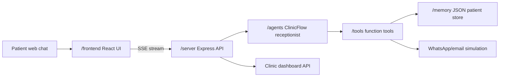

# ClinicFlow AI

ClinicFlow AI is an AI-native clinic front desk system. It uses the OpenAI Agents SDK on the server, a streaming web UI on the frontend, function tools for clinic operations, and a local patient memory store.

## Architecture



## What It Does

- Books and reschedules appointments through tool calls.
- Checks doctor availability before confirming a time.
- Persists patient memory: name, symptoms, visits, appointment history, and notes.
- Streams receptionist responses to the UI.
- Streams tool execution indicators such as “Checking availability...” and “Booking appointment...”.
- Flags emergency symptoms before routine scheduling.
- Simulates WhatsApp/email/SMS confirmations.

## Project Structure

```text
/frontend   React chat, confirmation screen, and dashboard
/server     Express API routes and streaming runtime
/agents     Clinic receptionist agent definition
/tools      OpenAI Agents SDK function tools
/memory     Persistent patient memory store
/tests      Integration tests for booking, memory, streaming, and emergency flow
/skills     Repo-local planning skill references
```

## Setup

```bash
npm install
cp .env.example .env
```

For real OpenAI runs, set:

```bash
OPENAI_API_KEY=sk-your-key
CLINICFLOW_DEMO_MODE=0
```

If no key is present, the server automatically uses demo mode so the UI and tests still exercise streaming, tool events, booking, memory, and emergency triage.

## Run

```bash
npm run dev
```

- Frontend: `http://localhost:5173`
- Backend: `http://localhost:8787`

## Test

```bash
npm run test:integration
```

## How The Agent And Tools Work

The receptionist agent is defined in `agents/clinicReceptionist.ts`. It is instructed to act like clinic front desk staff, ask focused follow-up questions, use memory for returning patients, and never confirm a booking unless `book_appointment` succeeds.

Tools are defined in `tools/clinicTools.ts` with strict Zod schemas:

- `check_doctor_availability()`
- `book_appointment()`
- `reschedule_appointment()`
- `fetch_patient_history()`
- `create_or_update_patient_record()`
- `send_whatsapp_confirmation()`
- `flag_emergency_case()`

The memory store in `memory/store.ts` persists to `memory/data/clinicflow-store.json`.

## Production Agent Spec

The system-ready contract is documented in `AGENTS.md`, `SKILL.md`, and implemented in `agents/workflowContracts.ts`.

Workflow states:

- `SESSION_ROUTING`
- `INTAKE`
- `COLLECT_INFO`
- `MEMORY_LOOKUP`
- `CHECK_ACTIVE_BOOKINGS`
- `CHECK_AVAILABILITY`
- `BOOK_APPOINTMENT`
- `RESCHEDULE_APPOINTMENT`
- `CONFIRMATION`
- `EMERGENCY_ROUTING`
- `FAILURE_RECOVERY`

Core data models:

- Patient: `id`, `name`, `phone`, symptom history, appointment IDs, notes.
- Appointment: `id`, `patient_id`, `doctor_id`, time window, symptoms, status, confirmation ID.
- Doctor schedule: doctor identity, specialty, and available slots.

Safety boundaries:

- ClinicFlow AI does not diagnose, prescribe, or provide treatment plans.
- Symptoms are collected only for routing, scheduling, and triage.
- Emergency symptoms are routed before ordinary booking.
- Emergency advice is to call emergency services or go to the nearest ER.

Appointment guardrails:

- Morning slots are only 8:00 AM-11:59 AM.
- Afternoon slots are only 12:00 PM-4:59 PM.
- Evening slots are only 5:00 PM-8:00 PM.
- Booking requests check active appointments before creating a new appointment.
- Repeated booking text does not create duplicate appointments; the agent offers reschedule/cancel instead.

Session isolation:

- Incoming gateway messages are routed by `phoneNumber` or session metadata before agent processing.
- Phone/name mismatch creates a fresh session and clears active UI memory widgets.
- Patient B messages are not appended to Patient A's session transcript.

Integration layer:

- Calendar connector: demo store now, Google Calendar/internal scheduler later.
- Messaging connector: demo WhatsApp/email/SMS now, Twilio/WhatsApp Business/SendGrid later.
- Database connector: JSON store now, Postgres/Supabase/CRM/EHR later.

## Example Conversations

Booking:

```text
Patient: Hi, I'm Didarul Azam and I need an afternoon appointment for fever. My phone is 555-0199.
ClinicFlow AI: You are all set, Didarul Azam. I booked you with Dr. Maya Patel for tomorrow afternoon. Your WhatsApp confirmation has been sent with reference apt_...
```

Emergency:

```text
Patient: This is Omar Rahman. I have chest pain and shortness of breath.
ClinicFlow AI: I have flagged this as urgent for clinic triage. Please call emergency services or go to the nearest ER now.
```

## Validation Checklist

- [x] Patient booking flow works end-to-end.
- [x] Tool calls are triggered correctly.
- [x] Memory persists across sessions in `memory/data/clinicflow-store.json`.
- [x] Streaming UI works with partial response chunks.
- [x] Emergency detection works.
- [x] WhatsApp/email/SMS confirmation simulation works.

## Notes

The production path uses the current Agents SDK pattern: `Agent`, strict `tool()` definitions with Zod parameters, and `run(agent, input, { stream: true })` for streamed runtime events. Demo mode is intentionally deterministic for local validation without an API key.
